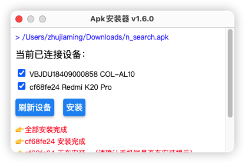

## 安装包下载

windows: [ApkInstaller.exe](https://github.com/zhujiaming/electron-apk-installer/releases/download/1.5.0-all/Apk.Installer.Setup.1.5.0.exe)

macos: [ApkInstaller-1.5.0.dmg](https://github.com/zhujiaming/electron-apk-installer/releases/download/1.5.0-all/Apk.Installer-1.5.0.dmg)

## Apk Installer

  一款pc端使用的apk安装器，可以通过双击Apk直接将Apk安装到当前已连接Window/MacOs的Andorid手机设备上。

  拆包即用，应用已关联apk的默认打开方式，双击apk文件即可直接选择设备安装。

> 免去每次输入命令安装或者安装第三方应用关联一堆功能的烦恼。

## 开发过程
[《使用Electron开发一款Apk安装器应用》](https://www.jianshu.com/p/a32542277b83)
